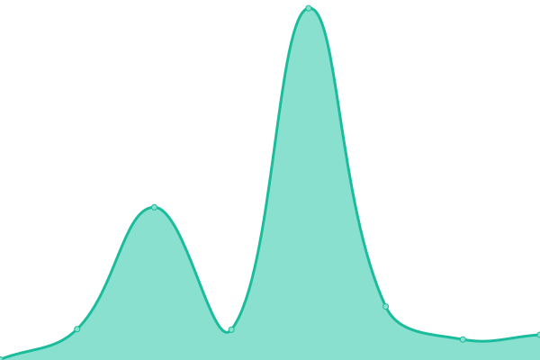
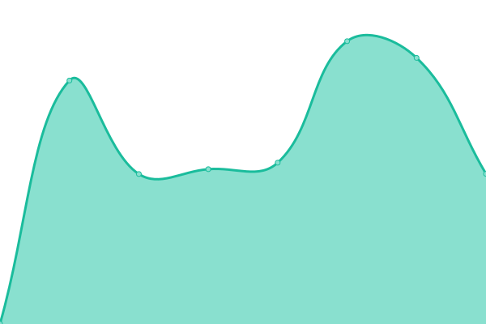

# [📈 实时状态](https://status.ziyuesinicization.site): <！ -实时状态- > **所有系统都可以正常运行**

This repository contains the open-source uptime monitor and status page for [子悦解说](https://ziyuesinicization.site/), powered by [Upptime](https://github.com/upptime/upptime).

With [Upptime](https://upptime.js.org), you can get your own unlimited and free uptime monitor and status page, powered entirely by a GitHub repository. We use [Issues](https://github.com/ZiYueCommentary/website-status/issues) as incident reports, [Actions](https://github.com/ZiYueCommentary/website-status/actions) as uptime monitors, and [Pages](https://status.ziyuesinicization.site) for the status page.

## [📈 Live Status](https://demo.upptime.js.org): <!--live status--> **所有系统都可以正常运行**

<!--start: status pages-->
<!-- This summary is generated by Upptime (https://github.com/upptime/upptime) -->
<!-- Do not edit this manually, your changes will be overwritten -->
<!-- prettier-ignore -->
| 链接 | 状态 | 历史 | 响应时间 | 正常运行时间 |
| --- | ------ | ------- | ------------- | ------ |
|  [www.ziyuesinicization.site](https://www.ziyuesinicization.site/) | 🟩 正常运行 | [www-ziyuesinicization-site.yml](https://github.com/ZiYueCommentary/website-status/commits/HEAD/history/www-ziyuesinicization-site.yml) | 

 142毫秒
     
 | 

<a href="https://status.ziyuesinicization.site/history/www-ziyuesinicization-site">100.00%</a>
    

|  [forum.ziyuesinicization.site](https://forum.ziyuesinicization.site/) | 🟩 正常运行 | [forum-ziyuesinicization-site.yml](https://github.com/ZiYueCommentary/website-status/commits/HEAD/history/forum-ziyuesinicization-site.yml) | 

 1853毫秒
     
 | 

<a href="https://status.ziyuesinicization.site/history/forum-ziyuesinicization-site">99.72%</a>
    

|  [blog.ziyuesinicization.site](https://blog.ziyuesinicization.site/) | 🟩 正常运行 | [blog-ziyuesinicization-site.yml](https://github.com/ZiYueCommentary/website-status/commits/HEAD/history/blog-ziyuesinicization-site.yml) | 

 1322毫秒
     
 | 

<a href="https://status.ziyuesinicization.site/history/blog-ziyuesinicization-site">99.73%</a>
    

|  [gitbook.ziyuesinicization.site](https://gitbook.ziyuesinicization.site/) | 🟩 正常运行 | [gitbook-ziyuesinicization-site.yml](https://github.com/ZiYueCommentary/website-status/commits/HEAD/history/gitbook-ziyuesinicization-site.yml) | 

 445毫秒
     
 | 

<a href="https://status.ziyuesinicization.site/history/gitbook-ziyuesinicization-site">100.00%</a>
    

|  [weblate.ziyuesinicization.site](https://weblate.ziyuesinicization.site/) | 🟩 正常运行 | [weblate-ziyuesinicization-site.yml](https://github.com/ZiYueCommentary/website-status/commits/HEAD/history/weblate-ziyuesinicization-site.yml) | 

 544毫秒
     
 | 

<a href="https://status.ziyuesinicization.site/history/weblate-ziyuesinicization-site">99.63%</a>
    

|  [files.ziyuesinicization.site](https://files.ziyuesinicization.site/) | 🟩 正常运行 | [files-ziyuesinicization-site.yml](https://github.com/ZiYueCommentary/website-status/commits/HEAD/history/files-ziyuesinicization-site.yml) | 

 185毫秒
     
 | 

<a href="https://status.ziyuesinicization.site/history/files-ziyuesinicization-site">100.00%</a>
    

|  [alist.ziyuesinicization.site](https://alist.ziyuesinicization.site/) | 🟩 正常运行 | [alist-ziyuesinicization-site.yml](https://github.com/ZiYueCommentary/website-status/commits/HEAD/history/alist-ziyuesinicization-site.yml) | 

 638毫秒
     
 | 

<a href="https://status.ziyuesinicization.site/history/alist-ziyuesinicization-site">99.63%</a>
    

|  [www.scpcbgame.cn](https://www.scpcbgame.cn/) | 🟩 正常运行 | [www-scpcbgame-cn.yml](https://github.com/ZiYueCommentary/website-status/commits/HEAD/history/www-scpcbgame-cn.yml) | 

 1071毫秒
     
 | 

<a href="https://status.ziyuesinicization.site/history/www-scpcbgame-cn">99.71%</a>
    

|  [ntf.scpcbgame.cn](https://ntf.scpcbgame.cn/) | 🟩 正常运行 | [ntf-scpcbgame-cn.yml](https://github.com/ZiYueCommentary/website-status/commits/HEAD/history/ntf-scpcbgame-cn.yml) | 

 1310毫秒
     
 | 

<a href="https://status.ziyuesinicization.site/history/ntf-scpcbgame-cn">99.71%</a>
    

|  [www.deltarune.cn](https://www.deltarune.cn/) | 🟩 正常运行 | [www-deltarune-cn.yml](https://github.com/ZiYueCommentary/website-status/commits/HEAD/history/www-deltarune-cn.yml) | 

 1284毫秒
     
 | 

<a href="https://status.ziyuesinicization.site/history/www-deltarune-cn">99.01%</a>
    

<!--end: status pages-->

[**Visit our status website →**](https://status.ziyuesinicization.site)

## 📄 License

- Powered by: [Upptime](https://github.com/upptime/upptime)
- Code: [MIT](./LICENSE) © [子悦解说](https://ziyuesinicization.site/)
- Data in the `./history` directory: [Open Database License](https://opendatacommons.org/licenses/odbl/1-0/)
